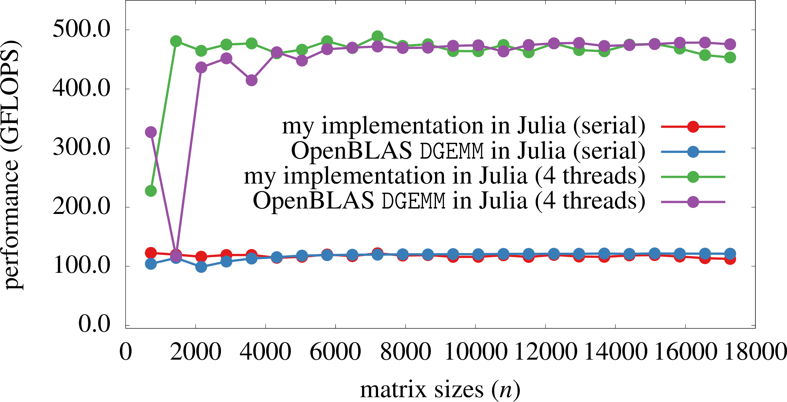

# Julia Matmul Zen5

This repository demonstrates that the Julia programming language is a high-performance
language by implementing an optimized matrix–matrix multiplication kernel in Julia,
targeting 5th Gen AMD EPYC CPU on the [Otus](https://pc2.uni-paderborn.de/go/otus)
HPC system at [Paderborn Center for Parallel Computing](https://pc2.uni-paderborn.de/).

See the Julia source code for implementation details.

